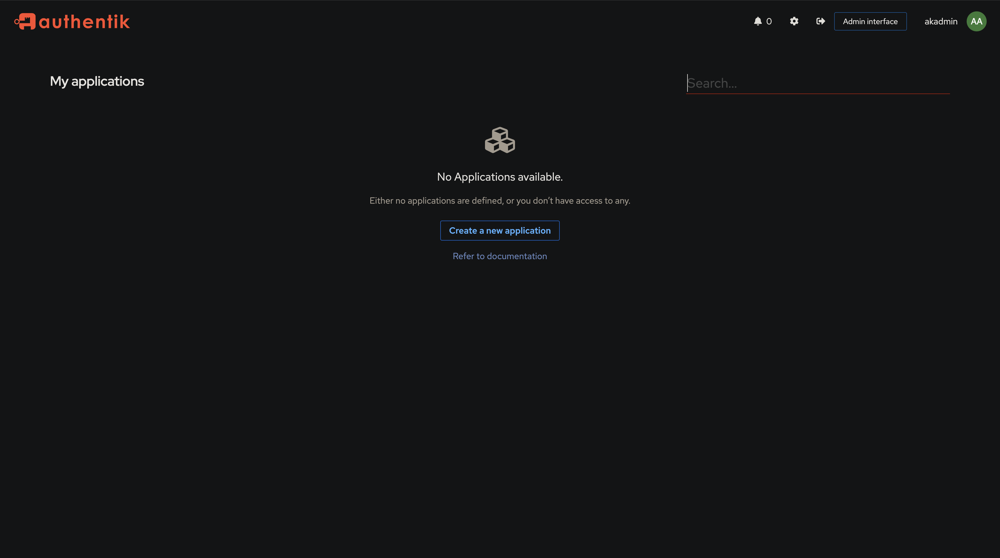
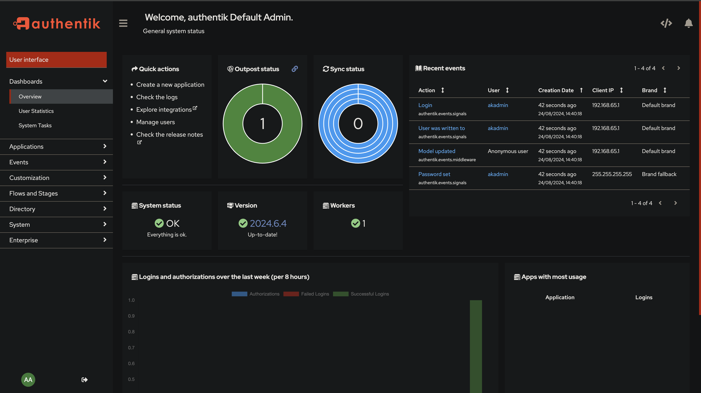

# Authentik 

## What is it?

**Authentik** is an open-source Identity Provider (IdP) and Single Sign-On (SSO) solution designed to provide secure, flexible, and user-friendly authentication and authorisation for web applications and services. Built with scalability and modern standards in mind, Authentik integrates seamlessly into diverse environments, offering a wide range of authentication methods and protocols to meet the needs of various organisations.

Whether you're a small business or a large enterprise, Authentik offers the flexibility and security to meet your needs. 

## Key Features

- **Single Sign-On (SSO)**: Authentik supports SSO across multiple applications, allowing users to authenticate once and gain access to all connected services without re-entering credentials.

- **Multiple Authentication Protocols**: Supports a wide range of authentication protocols including OAuth2, OpenID Connect (OIDC), SAML, and LDAP, ensuring compatibility with a broad spectrum of applications and services.

- **Flexible User Management**: Provides robust user management features such as user provisioning, de-provisioning, and synchronisation with external identity providers like LDAP or Active Directory.

- **Customisable Workflows**: Authentik allows for the creation of custom workflows and policies tailored to specific organisational requirements, enhancing security and user experience.

- **Adaptive Multi-Factor Authentication (MFA)**: Enhance security by enabling MFA, which can be adapted based on user behavior, location, device, and more.

- **Extensible and Modular Architecture**: Designed with a modular approach, allowing easy integration of new authentication methods, connectors, and custom plugins.

- **User-Friendly Interface**: Provides an intuitive web-based interface for both administrators and end-users, simplifying the management of authentication policies and user access.

- **Self-Hosted and Secure**: Being self-hosted, Authentik ensures that all user data remains under your control, with advanced security features to protect against unauthorised access and data breaches.

- **Active Community and Support**: Authentik is backed by a vibrant community and comprehensive documentation, making it easier to get started and find support when needed.

## Getting Started

To get started with Authentik, you'll need to:

1. **Deploy Authentik**: Follow the installation guide to set up Authentik on your server using Docker, Kubernetes, or other supported deployment methods.

2. **Configure Your Applications**: Integrate your applications and services with Authentik using the supported authentication protocols (OAuth2, OIDC, SAML, etc.).

3. **Set Up User Authentication**: Define authentication flows, configure MFA, and manage user access through the intuitive Authentik interface.

4. **Explore Advanced Features**: Leverage Authentik's advanced features like adaptive MFA, custom workflows, and detailed auditing to enhance your security posture.

For more information, visit the [Authentik documentation](https://docs.goauthentik.io/docs/) and join the community on [GitHub](https://github.com/goauthentik/authentik) to contribute or seek support.

## Running Authentik in Docker

If this is a fresh authentik installation, you need to generate a password and a secret key. Use a secure password generator of your choice such as pwgen, or you can use openssl as below.

Run the following commands to generate a password and secret key and write them to your .env file:

```
echo "PG_PASS=$(openssl rand -base64 36 | tr -d '\n')" >> .env
echo "AUTHENTIK_SECRET_KEY=$(openssl rand -base64 60 | tr -d '\n')" >> .env
```

Because of a PostgreSQL limitation, only passwords up to 99 chars are supported. See: https://www.postgresql.org/message-id/09512C4F-8CB9-4021-B455-EF4C4F0D55A0@amazon.com

To enable error reporting, run the following command:

```
echo "AUTHENTIK_ERROR_REPORTING__ENABLED=true" >> .env
```

## Email configuration (optional but recommended)

It is also recommended to configure global email credentials. These are used by authentik to notify you about alerts and configuration issues. They can also be used by Email stages to send verification/recovery emails.

To configure email credentials, append this block to your .env file

```
# SMTP Host Emails are sent to
AUTHENTIK_EMAIL__HOST=localhost
AUTHENTIK_EMAIL__PORT=25
# Optionally authenticate (don't add quotation marks to your password)
AUTHENTIK_EMAIL__USERNAME=
AUTHENTIK_EMAIL__PASSWORD=
# Use StartTLS
AUTHENTIK_EMAIL__USE_TLS=false
# Use SSL
AUTHENTIK_EMAIL__USE_SSL=false
AUTHENTIK_EMAIL__TIMEOUT=10
# Email address authentik will send from, should have a correct @domain
AUTHENTIK_EMAIL__FROM=authentik@localhost
```

## Configure for port 80/443

By default, authentik listens internally on port 9000 for HTTP and 9443 for HTTPS. To change the exposed ports to 80 and 443, you can set the following variables in .env:

```
COMPOSE_PORT_HTTP=80
COMPOSE_PORT_HTTPS=443
```

See Configuration to change the internal ports. Be sure to run `docker compose up -d` to rebuild with the new port numbers.

## Startup 

### Warning!

The server assumes to have local timezone as UTC. All internals are handled in UTC; whenever a time is displayed to the user in UI, the time shown is localized. Do not update or mount `/etc/timezone` or `/etc/localtime` in the authentik containers. This will not give any advantages. It will cause problems with OAuth and SAML authentication, e.g. [see this GitHub issue](https://github.com/goauthentik/authentik/issues/3005).

Afterward, run these commands to finish:

```
docker compose pull
docker compose up -d
```

The `docker-compose.yml` file statically references the latest version available at the time of downloading the compose file. Each time you upgrade to a newer version of authentik, you download a new docker-compose.yml file, which points to the latest available version. 

For more information, refer to the Upgrading section in the [Release Notes](https://docs.goauthentik.io/docs/releases).

To start the initial setup, navigate to `http://<your server's IP or hostname>:9000/if/flow/initial-setup/`.

If you decide to use the .env.example provided, navigate to `http://localhost:9000/if/flow/initial-setup/`

There you are prompted to set a password for the akadmin user (the default user).

Upon successful login, you are greeted by the page below:



# Admin UI

To go to the Admin UI, click on the button "Admin Interface" located at the top right hand corner of the page, and you will be directed to the page below.



Have fun!